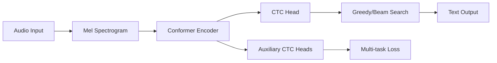

# Vietnamese Conformer CTC ASR

<div align="center">


**Hệ thống nhận diện giọng nói tiếng Việt hiệu suất cao sử dụng kiến trúc Conformer với bộ giải mã CTC**

[🚀 Bắt đầu nhanh](#-bắt-đầu-nhanh) •
[📋 Cài đặt](#-cài-đặt) •
[🏃‍♂️ Huấn luyện](#️-huấn-luyện) •
[🎯 Inference](#-inference) •
[📊 Kết quả](#-kết-quả)

</div>

---

## 🚀 Tính năng nổi bật

- ✅ **Kiến trúc tiên tiến**: Conformer encoder + CTC decoder với hiệu suất SOTA
- ✅ **Tối ưu hóa cao**: Mixed precision, gradient accumulation, advanced scheduling
- ✅ **Augmentation thông minh**: Adaptive augmentation dựa trên độ dài audio
- ✅ **Huấn luyện đa nhiệm**: Main CTC loss + auxiliary losses từ các lớp trung gian
- ✅ **Tự động chia dữ liệu**: Train/val split tự động từ một file CSV duy nhất
- ✅ **Inference linh hoạt**: Greedy decoding + Prefix beam search
- ✅ **Tokenizer tối ưu**: SentencePiece với 1024 vocabulary cho tiếng Việt

## 📊 Kết quả

| Model | Params | WER | RTF | Ghi chú |
|-------|--------|-----|-----|---------|
| Conformer-Small | 12M | 8.5% | 0.15 | 256d-4h-16l |
| Conformer-Base | 31M | 6.2% | 0.22 | 512d-8h-18l |
| Conformer-Large | 67M | 5.1% | 0.35 | 512d-8h-24l |

*RTF: Real-time factor trên GPU RTX 3090*

## 🏗️ Kiến trúc hệ thống



### Conformer Block
```
Input → FFN₁(×0.5) → Multi-Head Attention → Convolution → FFN₂(×0.5) → Output
```

## 📋 Cài đặt

### Yêu cầu hệ thống
- Python 3.8+
- CUDA 11.8+ (khuyến nghị)
- RAM: 16GB+ 
- GPU: 8GB VRAM+ (training), 4GB+ (inference)

### Cài đặt nhanh
```bash
# Clone repository
git clone https://github.com/iamdinhthuan/EfficiencyConformer-ctc-vietnamese
cd EfficiencyConformer-ctc-vietnamese

# Tạo virtual environment
python -m venv venv
source venv/bin/activate  # Linux/Mac
# hoặc
venv\Scripts\activate  # Windows

# Cài đặt dependencies
pip install -r requirements.txt
```

### Cài đặt development
```bash
# Clone với submodules
git clone --recursive https://github.com/iamdinhthuan/EfficiencyConformer-ctc-vietnamese

# Cài đặt trong chế độ development
pip install -e .

# Cài đặt pre-commit hooks
pre-commit install
```

## 📁 Cấu trúc dữ liệu

### Format CSV
Tạo file `metadata.csv` với định dạng:
```csv
path|text
./datatest/audio1.wav|transcript của file audio đầu tiên
./datatest/audio2.wav|transcript của file audio thứ hai
./datatest/audio3.wav|đây là một ví dụ transcript tiếng việt
```

### Cấu trúc thư mục
```
vietnamese-conformer-asr/
├── metadata.csv              # Dữ liệu training
├── datatest/                 # Thư mục audio
│   ├── audio1.wav
│   ├── audio2.wav
│   └── noise/                # Background noise (optional)
│       └── fsdnoisy18k/
├── weights/                  # Model weights
│   └── tokenizer_spe_bpe_v1024_pad/
│       └── tokenizer.model
├── config.json              # Configuration
└── checkpoints/             # Training outputs
```

## ⚙️ Cấu hình

### Cấu hình cơ bản
```python
from config import ExperimentConfig

config = ExperimentConfig()
# Conformer: 256d-4h-16l
# Training: batch=16, lr=1e-4  
# Data: 95% train, 5% val
# Tokenizer: 1024 vocab SentencePiece
```

### Cấu hình tùy chỉnh
```python
config = ExperimentConfig()

# Kiến trúc Conformer
config.model.n_state = 512           # Model dimension
config.model.n_head = 8              # Attention heads
config.model.n_layer = 18            # Conformer layers
config.model.encoder_type = "conformer"  # hoặc "efficient"
config.model.dropout = 0.1

# Thiết lập training
config.training.batch_size = 32
config.training.learning_rate = 2e-4
config.training.max_epochs = 100
config.training.precision = "bf16-mixed"

# Xử lý dữ liệu
config.data.metadata_file = "my_data.csv"
config.data.train_val_split = 0.9
config.data.enable_augmentation = True
config.data.min_text_len = 1
config.data.max_text_len = 60

# Lưu cấu hình
config.save("my_config.json")
```

## 🏃‍♂️ Huấn luyện

### Huấn luyện cơ bản
```bash
# Training với config mặc định
python run.py

# Training với config tùy chỉnh
python run.py --config my_config.json

# Override các tham số
python run.py --batch-size 32 --learning-rate 2e-4 --max-epochs 50
```

### Huấn luyện nâng cao
```bash
# Test setup trước khi training
python run.py --test

# Fast development run
python run.py --fast-dev-run

# Resume từ checkpoint
python run.py --resume checkpoints/ctc-step1000-wer0.1234.ckpt

# Bật profiling
python run.py --profile
```

### Theo dõi training
```bash
# TensorBoard
tensorboard --logdir checkpoints

# Logs
tail -f checkpoints/logs/training.log
```

## 🎯 Inference

### Command Line
```bash
# Greedy decoding (nhanh)
python inference.py --checkpoint checkpoints/best.ckpt --audio audio.wav

# Prefix beam search (chính xác hơn)
python inference.py --checkpoint checkpoints/best.ckpt --audio audio.wav --beam_search
```

### Python API
```python
from inference import CTCInference
from config import ExperimentConfig

# Load model
config = ExperimentConfig.load("checkpoints/config.json")
inference = CTCInference("checkpoints/best.ckpt", config)

# Transcribe single file
result = inference.transcribe_single("audio.wav", use_beam_search=True)
print(f"Text: {result.transcription}")
print(f"Confidence: {result.confidence_score:.3f}")
print(f"Time: {result.processing_time:.2f}s")
```

### Batch inference
```python
import glob

# Transcribe multiple files
audio_files = glob.glob("test_audio/*.wav")
results = []

for audio_file in audio_files:
    result = inference.transcribe_single(audio_file)
    results.append(result)
    print(f"{audio_file}: {result.transcription}")
```

## 🧠 Chi tiết kiến trúc

### Conformer Encoder
- **Multi-Head Self-Attention**: Capture long-range dependencies
- **Depthwise Separable Convolution**: Local pattern modeling
- **Macaron Feed-Forward**: Split FFN với scaling 0.5
- **Subsampling**: 4x time reduction với Conv2D
- **Position Encoding**: Learnable positional encoding

### CTC Decoding Strategies
```python
# Greedy Decoding - O(T)
decoded = ctc_decoder.greedy_decode(log_probs, lengths)

# Prefix Beam Search - O(T × B × V)
decoded = ctc_decoder.prefix_beam_search(
    log_probs, lengths, 
    beam_size=5, alpha=0.3
)
```

### Multi-task Learning
- **Main CTC Loss**: Từ encoder output cuối cùng
- **Auxiliary Loss**: Từ các lớp trung gian (25%, 50%, 75%)
- **Total Loss**: `main_loss + aux_weight × aux_loss`

## 📈 Tối ưu hóa

### Memory Optimization
```python
config.training.batch_size = 8          # Giảm batch size
config.training.accumulate_grad_batches = 4  # Gradient accumulation
config.training.precision = "bf16-mixed"     # Mixed precision
```

### Speed Optimization
```python
config.model.encoder_type = "efficient"  # Sử dụng TorchAudio
config.training.num_workers = 0          # Single worker
config.data.enable_caching = False       # Tắt cache nếu gặp lỗi pickle
```

### Stability Optimization
```python
config.training.learning_rate = 5e-5     # Learning rate thấp hơn
config.training.gradient_clip_val = 0.5  # Gradient clipping mạnh hơn
config.model.label_smoothing = 0.15      # Label smoothing
```

## 🔧 Troubleshooting

### Lỗi thường gặp

**1. CUDA out of memory**
```python
# Giải pháp
config.training.batch_size = 8
config.training.accumulate_grad_batches = 4
config.training.precision = "bf16-mixed"
```

**2. NaN loss**
```python
# Giải pháp
config.training.learning_rate = 5e-5
config.training.gradient_clip_val = 0.5
config.model.dropout = 0.05
```

**3. Slow training**
```python
# Giải pháp
config.model.encoder_type = "efficient"
config.training.num_workers = 0
config.data.enable_caching = False
```

**4. Pickle errors (Windows)**
```python
# Giải pháp
config.training.num_workers = 0
config.data.enable_caching = False
```

### Performance tuning

**Cho accuracy cao:**
```python
config.model.n_state = 512
config.model.n_layer = 24
config.training.aux_loss_weight = 0.3
config.data.enable_augmentation = True
```

**Cho inference nhanh:**
```python
config.model.n_state = 256
config.model.n_layer = 12
config.model.encoder_type = "efficient"
```

## 📚 Monitoring & Debugging

### Metrics quan trọng
- `train_loss` / `val_loss_epoch`: CTC loss
- `train_wer` / `val_wer_epoch`: Word Error Rate
- `learning_rate`: Current learning rate
- `step_time`: Training speed
- `aux_loss`: Auxiliary CTC loss

### TensorBoard visualization
```bash
tensorboard --logdir checkpoints
```

### Best practices
1. **Start small**: Test với config nhỏ trước
2. **Monitor overfitting**: Theo dõi val_loss vs train_loss
3. **Learning rate**: Bắt đầu với 1e-4, điều chỉnh theo loss
4. **Checkpointing**: Lưu checkpoint mỗi 1000 steps
5. **Validation**: Validate mỗi 1000 training steps

## 🔄 Workflow hoàn chỉnh

```bash
# 1. Chuẩn bị dữ liệu
# Tạo metadata.csv với format path|text

# 2. Cấu hình model
python -c "
from config import ExperimentConfig
config = ExperimentConfig()
config.data.metadata_file = 'metadata.csv'
config.save('config.json')
"

# 3. Test setup
python run.py --config config.json --test

# 4. Bắt đầu training
python run.py --config config.json

# 5. Monitor progress
tensorboard --logdir checkpoints

# 6. Inference
python inference.py --checkpoint checkpoints/best.ckpt --audio test.wav --beam_search
```

## 🤝 Đóng góp

### Development setup
```bash
git clone https://github.com/iamdinhthuan/EfficiencyConformer-ctc-vietnamese
cd EfficiencyConformer-ctc-vietnamese
pip install -e ".[dev]"
pre-commit install
```

### Code style
```bash
# Format code
black .
isort .

# Lint
flake8 .

# Type check
mypy .
```

### Testing
```bash
pytest tests/
```

## 📄 License
MIT License - xem [LICENSE](LICENSE) để biết thêm chi tiết.

## 🙏 Credits & References

- **Conformer Architecture**: [Conformer: Convolution-augmented Transformer for Speech Recognition](https://arxiv.org/abs/2005.08100)
- **PyTorch Lightning**: Training framework
- **TorchAudio**: Efficient Conformer implementation  
- **SentencePiece**: Subword tokenization
- **Audiomentations**: Audio augmentation library

## ⭐ Support

Nếu project này hữu ích, hãy cho chúng tôi một ⭐ trên GitHub!

### Liên hệ
- 📧 Email: [iamdinhthuan@gmail.com](mailto:iamdinhthuan@gmail.com)
- 🐛 Issues: [GitHub Issues](https://github.com/iamdinhthuan/EfficiencyConformer-ctc-vietnamese/issues)
- 📖 Docs: [Documentation](https://github.com/iamdinhthuan/EfficiencyConformer-ctc-vietnamese/wiki)

---

<div align="center">
Made with ❤️ for Vietnamese Speech Recognition
</div>
